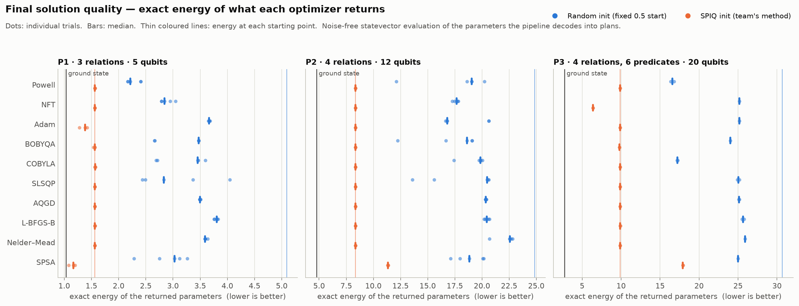
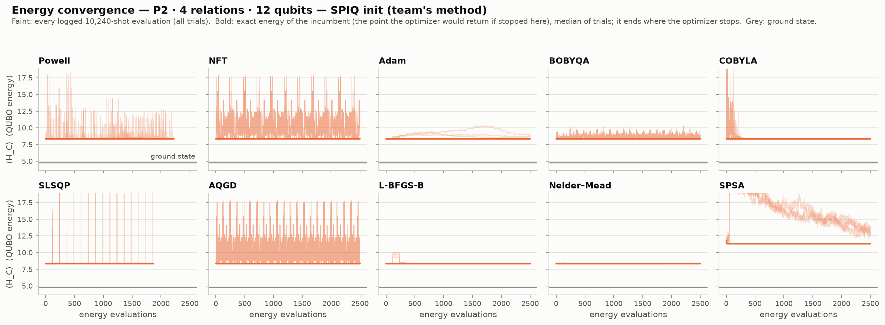
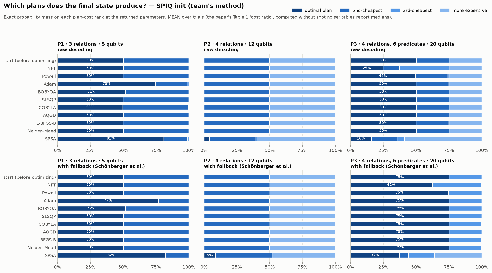

# Evidence for the four headline findings

Every number on this page is recomputed by **one script** from the published data. Anyone can re-run it:

```bash
cd optimizer_study
python verify_findings.py        # QAOA environment (requirements-study.txt); prints PASS/FAIL per check
```

**Current result: all checks PASS** (full output at the bottom).

What the evidence rests on:
- **The team's own code and data.** Their QUBO generator, their decoder, their SPIQ initializations and their committed logs are used. Finding 4 uses *nothing but* the team's code.
- **Exact (noise-free) energies** of what each optimizer returned. The two simulators behind them are checked against qiskit's own statevector to 10⁻¹⁰.
- **Every trial shown individually,** not only medians.

---

## Finding 1: from the random start, several optimizers beat COBYLA

**Claim.** On P1, Powell closes **71 %** of the gap between the start and the ground state, COBYLA **40 %**. On P2, Adam (40 %) and NFT (36 %) beat COBYLA (25 %).

| Problem | Optimizer | Gap closed, each trial | Median |
|---|---|---|---|
| P1 | COBYLA (team's baseline) | 0.37 · 0.40 · 0.40 · 0.59 · 0.59 | **0.40** |
| P1 | Powell | 0.66 · 0.66 · 0.71 · 0.72 · 0.72 | **0.71** |
| P2 | COBYLA | 0.24 · 0.25 · 0.25 · 0.26 · 0.37 | **0.25** |
| P2 | Adam | 0.21 · 0.21 · 0.40 · 0.40 · 0.41 | **0.40** |
| P2 | NFT | 0.35 · 0.35 · 0.36 · 0.37 · 0.38 | **0.36** |

**The strongest single fact:** on P1, **every one of Powell's 5 trials beats every one of COBYLA's 5 trials**
(Powell's worst: energy 2.406; COBYLA's best: 2.690). On P2 the medians differ clearly, but individual trials
overlap (Adam has two weak trials), so P2 supports "better on average" rather than "always better".

*Gap closed* = (start energy − returned energy) / (start energy − ground-state energy). 1.0 = ground state reached.

<picture>
  <source media="(prefers-color-scheme: dark)" srcset="figures/final_energy-dark.png">
  
</picture>

Raw data: [`analysis/runs.csv`](https://github.com/jananig-21/Projects/blob/quantumdb-optimizer-study/optimizer_study/analysis/runs.csv) (one row per run) ·
per-run files under [`results/P1/random/`](https://github.com/jananig-21/Projects/blob/quantumdb-optimizer-study/optimizer_study/results/P1/random).

---

## Finding 2: from the SPIQ start, COBYLA and most others don't improve anything

**Claim.** Starting from SPIQ, **6 of 10 optimizers, COBYLA included, close at most 1 % of the gap on every
problem** (BOBYQA manages 1.2 %, on P3 only). The small decrease in the team's logs is shot noise, not a better
answer. The cause is measured: at the SPIQ point the gradient is exactly zero, and **no single angle goes downhill**.

**(a) The logs say "improved"; the exact energy says "unchanged".** COBYLA, SPIQ start, median over trials:

| Problem | Change in the logged energy (what the logs suggest) | Change in the exact energy of what COBYLA returns (the truth) |
|---|---|---|
| P1 | −0.009 | **+0.009** |
| P2 | −0.056 | **+0.0015** |
| P3 | −0.064 | **+0.0048** |

The team's own committed logs show the same small logged decrease: P2 8.327 → 8.273 (−0.054, 2,331 evaluations),
P3 9.841 → 9.786 (−0.055, 5,698 evaluations). Every logged energy is a 10,240-shot *estimate* with noise ≈ 0.1
(P2/P3). Keeping the lowest of thousands of noisy estimates always produces a small "decrease", even when the
quantum state has not changed at all.

**(b) Why nothing moves: the SPIQ point is a flat spot with no downhill direction.**

| Problem | Angles | Gradient size at the SPIQ point | Gradient at a nearby random point | Single-angle directions: uphill / flat / **downhill** |
|---|---|---|---|---|
| P1 | 40 | 3 × 10⁻¹⁵ (zero) | 1.72 | 40 / 0 / **0** |
| P2 | 116 | 1 × 10⁻¹⁴ (zero) | 4.68 | 93 / 23 / **0** |
| P3 | 268 | 2 × 10⁻¹⁴ (zero) | 3.19 | 246 / 22 / **0** |

All three rows come from [`analysis/spiq_gradient.json`](https://github.com/jananig-21/Projects/blob/quantumdb-optimizer-study/optimizer_study/analysis/spiq_gradient.json).

Because each angle drives exactly one gate, the energy along each angle is an exact sine wave, so these
numbers are exact, not estimates ([`measure_spiq_gradient.py`](https://github.com/jananig-21/Projects/blob/quantumdb-optimizer-study/optimizer_study/measure_spiq_gradient.py)).

**(c) How many optimizers moved** (gap closed, median):

| Optimizer | P1 | P2 | P3 |
|---|---|---|---|
| COBYLA | −0.017 | −0.000 | −0.001 |
| AQGD | −0.000 | −0.000 | −0.000 |
| L-BFGS-B | −0.008 | −0.000 | −0.003 |
| Nelder–Mead | −0.002 | −0.000 | −0.001 |
| Powell | −0.002 | −0.000 | −0.000 |
| SLSQP | −0.003 | −0.001 | −0.000 |
| BOBYQA | 0.000 | −0.000 | 0.012 |
| Adam | **0.334** | 0.000 | −0.001 |
| NFT | −0.002 | −0.002 | **0.488** |
| SPSA | **0.747** | −0.840 | −1.128 |

<picture>
  <source media="(prefers-color-scheme: dark)" srcset="figures/convergence_P2_spiq-dark.png">
  
</picture>

*Bold lines (exact energy) stay flat for 9 of 10 optimizers; only SPSA moves, and it moves upward.*

---

## Finding 3: SPSA (on P1) and NFT (on P3) escape the SPIQ point

**Claim, stated precisely.**
- **SPSA on P1** lowers the energy in **all 3 trials** (1.561 → 1.08, 1.17, 1.20; ground state 1.031). In **2 of the 3** trials it also raises the chance of producing the optimal join order from 0.50 to **0.98–0.99**; the third stays at 0.50.
- **NFT on P3** lowers the energy in **both trials** from 9.867 to **6.38**, the largest real improvement in the study.
- **Caveat:** SPSA makes things *worse* on the bigger problems (P2: 8.34 → 11.34; P3: 9.87 → 17.9).

<picture>
  <source media="(prefers-color-scheme: dark)" srcset="figures/plan_costs_spiq-dark.png">
  
</picture>

*Top-left panel: SPSA's bar is the only one with far more "optimal plan" (dark) than the start.*

---

## Finding 4: on P2 the QUBO's lowest energy is not the best join order

**Claim.** On P2, the assignment with the lowest possible QUBO energy decodes to a join order costing **465**,
while the best join order costs **315**. So even a perfect optimizer would return a sub-optimal plan on P2.

**Proof, using only the team's code:**
1. Build P2's QUBO with the team's `QUBOGenerator.generate_IBMQ_QUBO_for_left_deep_trees_v2`.
2. Evaluate **all 4,096** possible assignments with the team's `qubo.objective.evaluate`. The lowest energy
   is **4.7664**, at bitstring `111100001100`.
3. Decode it with the team's `Postprocessing` functions. Raw order: `[1, 0, 3, 2]`, cost **465**. With the fallback:
   the same, cost **465**.
4. Cost all 24 join orders with the team's `get_costs_for_leftdeep_tree`. The optimal orders are `[0, 1, 2, 3]` and
   `[1, 0, 2, 3]`, cost **315**.

Consequence, visible in the data: SPIQ's P2 starting state puts **25 %** of its probability on that
ground state, yet produces an optimal plan **0 %** of the time.

---

<details>
<summary><b>Full output of <code>verify_findings.py</code></b></summary>

```
====================================================================================================
FINDING 1 - from the random start, several optimizers beat COBYLA
====================================================================================================
 P1: start 5.091, ground state 1.031
   COBYLA  gap closed per trial [0.369, 0.4, 0.404, 0.586, 0.591]  median 0.40
   POWELL  gap closed per trial [0.661, 0.661, 0.708, 0.719, 0.72]  median 0.71
   [PASS] P1: POWELL median gap closed (0.71) > COBYLA (0.40)
   [PASS] P1: EVERY Powell trial beats EVERY COBYLA trial (worst Powell 2.406 < best COBYLA 2.690)
 P2: start 24.842, ground state 4.766
   COBYLA  gap closed per trial [0.24, 0.247, 0.249, 0.255, 0.37]  median 0.25
   ADAM    gap closed per trial [0.21, 0.21, 0.4, 0.402, 0.408]  median 0.40
   [PASS] P2: ADAM median gap closed (0.40) > COBYLA (0.25)
   NFT     gap closed per trial [0.35, 0.353, 0.358, 0.367, 0.378]  median 0.36
   [PASS] P2: NFT median gap closed (0.36) > COBYLA (0.25)

====================================================================================================
FINDING 2 - from the SPIQ start, COBYLA and most others do not improve anything
====================================================================================================
 (a) What the logs show vs. what is true (COBYLA, SPIQ start, median over trials):
   P1: logged energy change -0.009   |   EXACT energy change of what COBYLA returns +0.0090
   [PASS] P1: logs show a decrease, but the exact energy did not improve by more than 0.01
   P2: logged energy change -0.056   |   EXACT energy change of what COBYLA returns +0.0015
   [PASS] P2: logs show a decrease, but the exact energy did not improve by more than 0.01
   P3: logged energy change -0.064   |   EXACT energy change of what COBYLA returns +0.0048
   [PASS] P3: logs show a decrease, but the exact energy did not improve by more than 0.01
 (b) The team's own committed logs show the same small logged decrease:
   team P2: first logged 8.327 -> best logged 8.273 (change -0.054) over 2331 evaluations
   team P3: first logged 9.841 -> best logged 9.786 (change -0.055) over 5698 evaluations
 (c) Why: exact gradient and single-angle curvature at the team's SPIQ point (measure_spiq_gradient.py):
   P1: 40 angles | |grad| = 3.2e-15 (vs 1.72 at a nearby random point) | single-angle directions: 40 uphill, 0 flat, 0 downhill
   [PASS] P1: gradient is zero (< 1e-10) and NO single angle goes downhill
   P2: 116 angles | |grad| = 1.4e-14 (vs 4.68 at a nearby random point) | single-angle directions: 93 uphill, 23 flat, 0 downhill
   [PASS] P2: gradient is zero (< 1e-10) and NO single angle goes downhill
   P3: 268 angles | |grad| = 2.0e-14 (vs 3.19 at a nearby random point) | single-angle directions: 246 uphill, 22 flat, 0 downhill
   [PASS] P3: gradient is zero (< 1e-10) and NO single angle goes downhill
 (d) How many optimizers improve on the SPIQ start (gap closed, median):
problem         P1     P2     P3
   optimizer                       
   ADAM         0.334  0.000 -0.001
   AQGD        -0.000 -0.000 -0.000
   BOBYQA       0.000 -0.000  0.012
   COBYLA      -0.017 -0.000 -0.001
   L_BFGS_B    -0.008 -0.000 -0.003
   NELDER_MEAD -0.002 -0.000 -0.001
   NFT         -0.002 -0.002  0.488
   POWELL      -0.002 -0.000 -0.000
   SLSQP       -0.003 -0.001 -0.000
   SPSA         0.747 -0.840 -1.128
   optimizers closing <= 1% of the gap on EVERY problem: ['AQGD', 'COBYLA', 'L_BFGS_B', 'NELDER_MEAD', 'POWELL', 'SLSQP']
   BOBYQA's best: 0.0122 of the gap (P3)
   [PASS] 6 of 10 optimizers (incl. COBYLA) close <= 1% on every problem

====================================================================================================
FINDING 3 - SPSA (P1) and NFT (P3) escape the SPIQ point
====================================================================================================
 P1 SPSA: exact energy per trial [1.082, 1.165, 1.2] (start 1.561, ground 1.031)
          optimal-plan ratio (team's metric, fallback) per trial [0.499, 0.979, 0.987] (start 0.500)
   [PASS] P1: every SPSA trial ends below the SPIQ start
   [PASS] P1: 2 of 3 SPSA trials raise the optimal-plan ratio from 0.50 to >= 0.97
 P3 NFT:  exact energy per trial [6.377, 6.387] (start 9.867, ground 2.725)
   [PASS] P3: every NFT trial ends >3 energy units below the SPIQ start
 caveat - P2 SPSA: exact energy [11.324, 11.339, 11.361] vs start 8.338 (worse)
 caveat - P3 SPSA: exact energy [17.906, 17.941] vs start 9.867 (worse)

====================================================================================================
FINDING 4 - on P2 the QUBO's ground state is NOT the optimal join order (team's code only)
====================================================================================================
 P2: card [10, 15, 20, 30], predicates [(0, 1), (2, 3)], selectivities [0.1, 0.1]; 12 binary variables -> 4096 assignments checked
   QUBO ground state: energy 4.7664, bitstring 111100001100
   decoded by the team's decoder: raw order [1, 0, 3, 2] (cost 465), with fallback [1, 0, 3, 2] (cost 465)
   true optimal join order(s) by brute force over all 24 orders: [[0, 1, 2, 3], [1, 0, 2, 3]] (cost 315)
   [PASS] P2 ground state decodes to cost 465 > optimal 315
   SPIQ's P2 start: probability on the ground state 0.25, probability of an optimal plan 0.000

====================================================================================================
SUMMARY: 15 of 15 checks PASS
```
</details>
