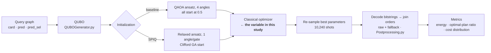
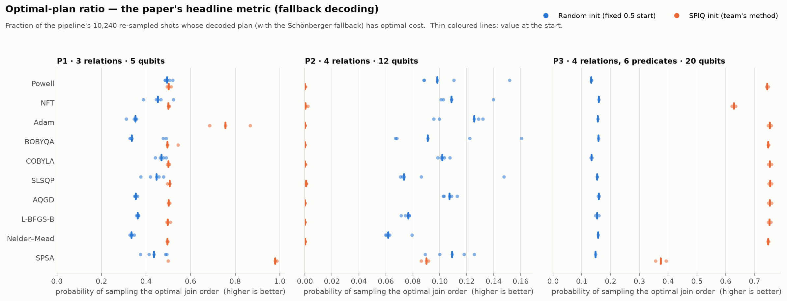
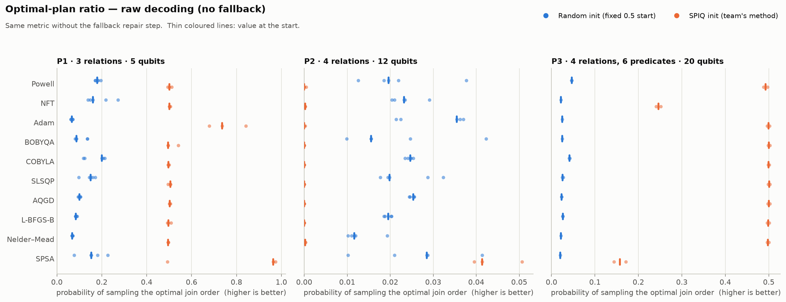
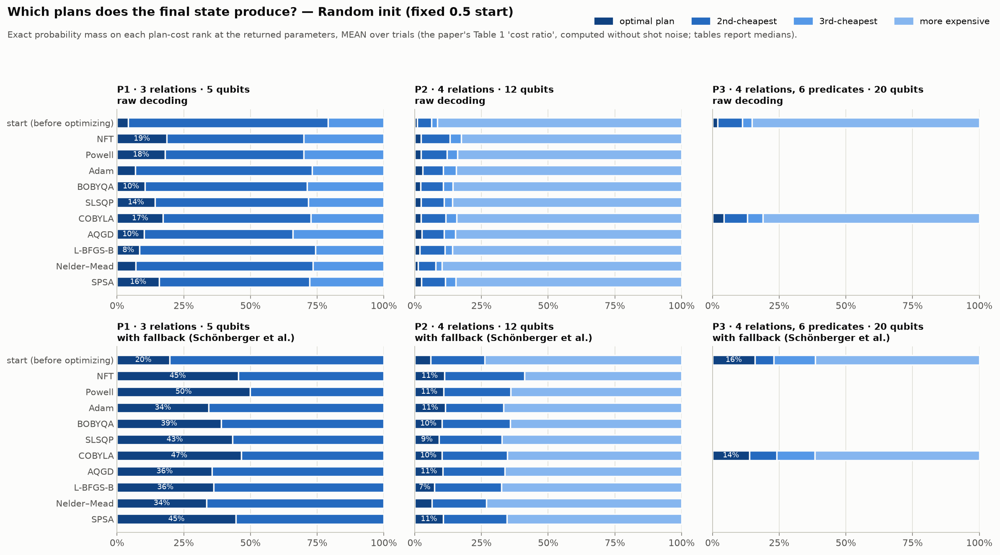
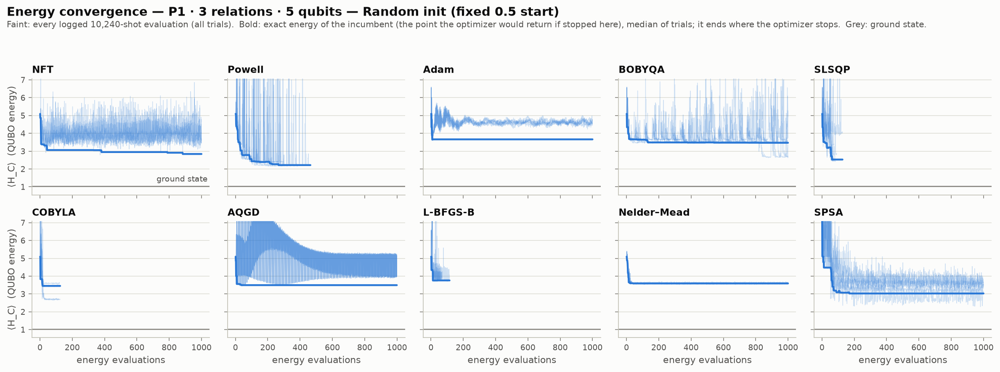
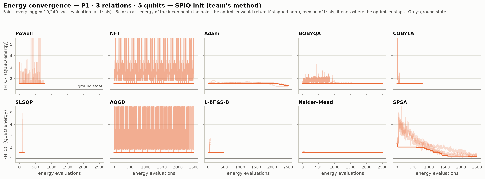
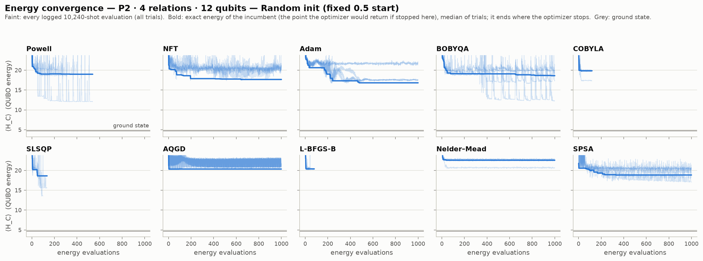
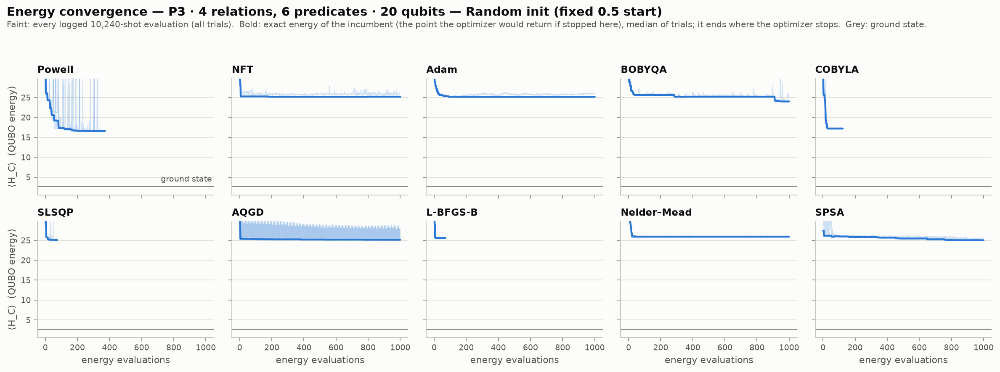
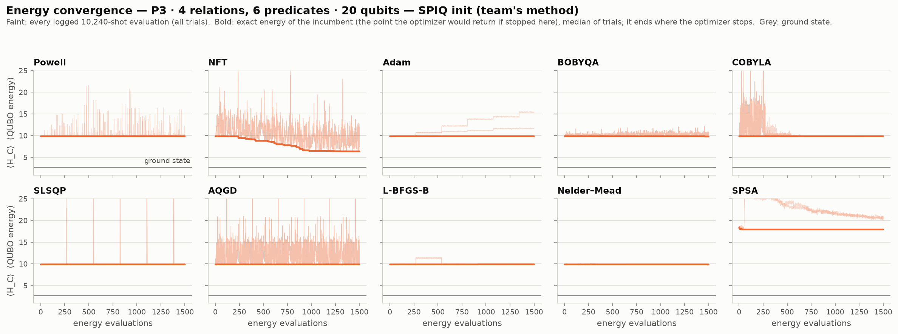
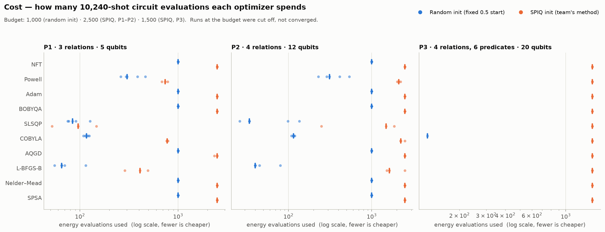

# Optimizer study: which classical optimizer should drive QAOA for join-order optimization?

**A controlled benchmark of 10 classical optimizers inside the UMich QuantumDB team's QAOA pipeline for
database join ordering. The team's own code, problems and SPIQ initializations are used unchanged, and
only the optimizer is swapped.**

> [!NOTE]
> **Interim results, updated Sep 28, 2026.** P1, P2 and P3's SPIQ arm are complete
> (181 of 210 runs). P3's *random-start* arm (20 qubits, ~35 s per evaluation through qiskit's stock QAOA
> path) is still running: 1 of 30 cells is in. Everything shown for P3 · random init is therefore
> provisional, and this page will be regenerated when the remaining runs finish.

---

> **Proof of each finding** (numbers, figures and a script that re-checks them): **[EVIDENCE.md](EVIDENCE.md)**

## 1. Key findings

1. **The harness reproduces the team's numbers.** Running their unmodified driver with COBYLA gives
   8.34 → 8.27 on P2 with SPIQ (team: 8.33 → 8.27) and 24.9 → 19.6 on P2 from the random start (team:
   24.8 → 19.7). Differences between optimizers below are therefore due to the optimizer, not the setup.

2. **From the random start, the optimizer matters, and COBYLA is middling.** On P1, **Powell** closes
   **71 %** of the gap to the ground state versus COBYLA's 40 %. On P2, **Adam** (40 %) and **NFT**
   (36 %) beat COBYLA (25 %). Cheap is not bad: **SLSQP** closes 56 % of P1's gap in just 84 evaluations.
   But none of the 10 optimizers gets near the ground state with depth-2 QAOA from this start.

3. **From the SPIQ start, 6 of 10 optimizers, COBYLA included, close at most 1 % of the gap on every problem**
   (BOBYQA manages 1.2 %, on P3 only). The
   SPIQ starting point is already better than anything the random start reaches (P1: 1.56 vs the best
   random result, 2.22). But the exact energy of what COBYLA returns is unchanged from the start on all three
   problems (P1 +0.009, P2 +0.001, P3 +0.005). The team's logged decrease (e.g. P2 8.33 → 8.27) is
   **shot-noise selection**: the best of ~2,000 noisy 10,240-shot readings, not a better quantum state.

4. **Three optimizers *do* escape the SPIQ point, each on a different problem.**
   **SPSA on P1** lowers the energy in all three trials (1.56 → 1.08–1.20, ground state 1.03) and takes
   the optimal-plan ratio from 0.50 to **0.98–0.99 in two of the three** (the third stays at 0.50).
   **Adam on P1** takes it to 0.76. **NFT on P3** delivers the largest real energy drop in the study,
   **9.87 → 6.38**. But SPSA is **unsafe** on the larger problems: it wrecks the SPIQ state on P2 (+3.0)
   and P3 (+8.1).

5. **Lower energy ≠ better join orders on this QUBO, and no optimizer can fix that.** P2's exact ground
   state decodes to a plan costing 465, not the optimal 315. SPIQ's P2 start puts **25 % of its
   probability on that ground state yet produces the optimal plan 0 % of the time**. SPSA *raises* P2's energy
   yet *raises* its optimal-plan ratio (0.00 → 0.09). NFT *lowers* P3's energy yet *lowers* its optimal-plan
   ratio (0.75 → 0.63). The QUBO's squared-log cost approximation and its penalty weighting, not the
   optimizer, cap plan quality.

6. **"Best energy seen" is the wrong yardstick for a noisy objective.** It rewards optimizers that just
   evaluate more. SPSA's log on P2 claims a 0.48 improvement while its true energy got 3.0 *worse*. This
   study scores the exact energy of what each optimizer actually returns.

**Practical recommendation for the pipeline:** from the random start, prefer **Powell** (small problems) or
**Adam/NFT** (larger ones) over COBYLA. On top of SPIQ, COBYLA adds cost without benefit. **NFT** is the natural
candidate there, because it is exact for SPIQ's one-angle-per-gate ansatz and gave the only large real gain on P3.
The biggest lever, though, is the **encoding** (finding 5), not the optimizer.

---

## 2. The project being studied

**Paper:** *Improving Join Order Optimization on Gate-Based Quantum Computers via Structured
Parameter Initialization* — Shekar, Wu, Bharadwaj, Ravi, Ma (VLDB 2026 Workshop QCDKM), built on
Schönberger et al., *Ready to Leap (by Co-Design)? Join Order Optimisation on Quantum Hardware*
(SIGMOD 2023). Code: branch `quantumdb-spiq-joo` (the team's latest, cleaned-up branch).

**The problem.** A database must choose the order in which to join relations; a bad order can
produce intermediate results orders of magnitude larger than necessary. The team encodes left-deep
join ordering as a **QUBO** (binary variables *v[t,j]* "relation *t* is in join *j*" and *p[k,j]*
"predicate *k* applies at join *j*"; validity penalties plus a squared-log intermediate-cardinality
cost), solves it with **QAOA** (depth *p* = 2) on a noiseless 10,240-shot simulator, decodes every
sampled bitstring into a join order (a score vector, plus the Schönberger *fallback* that avoids
cross products), and scores the plans classically.

**The contribution.** QAOA's classical optimizer starts from some angles. The team's baseline starts
every angle at 0.5 ("random / uninformed initialization"); their method, **SPIQ**, first searches
the space of *Clifford* angles (multiples of π/2, classically simulable with `stim`) with a genetic
algorithm, and hands QAOA the best one on a *relaxed* ansatz with one angle per gate. The
optimizer is **COBYLA** in both arms.



**Workloads** (`base/ExperimentalAnalysis/IBMQ/QPUPerformance/Problems/JSON/`):

| | Relations (cardinality) | Predicates (selectivity) | Qubits | Ground-state energy | Optimal plan cost | Distinct plan costs |
|---|---|---|---|---|---|---|
| **P1** | 10, 15, 20 | (0,1) 0.1 · (1,2) 0.1 | 5 | 1.031 | 15 | 3 |
| **P2** | 10, 15, 20, 30 | (0,1) 0.1 · (2,3) 0.1 | 12 | 4.766 | 315 | 11 |
| **P3** | 10, 15, 20, 30 | six predicates, sel. 0.1–0.6 | 20 | 2.725 | 39 | 12 |

Ground-state energies are exact (every one of the 2ⁿ bitstrings evaluated with the team's QUBO);
optimal plan costs come from brute force over every join order using the team's cost function
(`Postprocessing.get_costs_for_leftdeep_tree`). Both match the targets hard-coded in the team's R
notebook (cost 15 for P1, 315 for P2).

## 3. What this study changes — and what it keeps identical

**One variable: the classical optimizer.** The team's driver, `base/IBMQExperiments.py`, runs
**unmodified**. The harness (`run_study.py`) replaces three module-level hooks the driver already
exposes, and nothing else:

| Hook | Original | In this study |
|---|---|---|
| `get_optimizer()` | COBYLA (their option 1) | each optimizer under test, behind an evaluation-budget guard |
| `get_local_QASM_backend()` | `QasmSimulator`, 10,240 shots, unseeded | same simulator and shots; each execution gets a fresh seed from a per-trial RNG, so shot noise is fresh on every call (as in the original) but each trial is reproducible |
| `current_optim` | `"COBYLA"` | the optimizer's name (used by the driver in output filenames) |

**Kept identical:** the QUBO (`QUBOGenerator.generate_IBMQ_QUBO_for_left_deep_trees_v2`), the
problems, QAOA depth *p* = 2, the fixed `[0.5]*4` baseline start, the team's own committed SPIQ
initializations, SPIQ's relaxed ansatz and its built-in reproduction check, energies logged on the
QUBO scale, re-sampling of the best parameters, the pickled response, decoding with
`Postprocessing.readout` (raw and fallback), and all output file formats. The software stack is the
team's pinned QAOA environment: Python 3.8, `qiskit==0.34.2` (terra 0.19.2, Aer 0.10.3),
`qiskit-optimization==0.3.2`, `docplex==2.23.222`.

**SPIQ initializations are the team's own committed artifacts** — no new SPIQ search was run:

| Problem | Artifact | GA budget | Start energy | Driver's sanity check |
|---|---|---|---|---|
| P1 | `spiq_init_outputs/…_3rel_2pred.json` | 4,000 generations | 1.565 | rel. error 0.002 ✓ |
| P2 | `new_spiq_outputs/…_4rel_2pred.json` | 2,000 generations | 8.338 | rel. error 0.000 ✓ |
| P3 | `spiq_init_outputs/…_4rel2.json` | 4,000 generations | 9.875 | rel. error 0.001 ✓ |

(P3's file has no problem metadata; it is identified by its 268 angles — the size of P3's relaxed
ansatz — and its energy, 9.87 on the current P3 QUBO, matching the first logged energy of the
team's P3 SPIQ run, 9.84. The driver re-checks every artifact against the live QUBO before
optimizing.)

### Reproduction check — the harness recovers the team's own COBYLA numbers

| Problem · init | Source | Runs | First logged energy | Best logged energy | Evaluations |
|---|---|---|---|---|---|
| P1 · random | team's committed log | 1 | 5.086 | 2.754 | 119 |
| | this study's harness | 5 | median 5.110 | median 3.403 [2.636–3.545] | median 117 |
| P2 · random | team's committed log | 1 | 24.841 | 19.696 | 119 |
| | this study's harness | 5 | median 24.879 | median 19.621 [17.208–19.834] | median 115 |
| P2 · spiq | team's committed log | 2 | 8.327 / 8.382 | 8.273 / 8.263 | 2331 / 2432 |
| | this study's harness | 3 | median 8.335 | median 8.272 [8.271–8.279] | median 2247 |
| P3 · spiq | team's committed log | 1 | 9.841 | 9.786 | 5698 |
| | this study's harness | 2 | median 9.847 | median 9.784 [9.779–9.788] | median 1500 (budget 1,500) |

The team's P2 SPIQ result (8.33 → 8.27 in ~2,400 evaluations) is reproduced to the second decimal (8.34 → 8.27 in 2,247). P3 SPIQ matches too (9.84 → 9.79). The P1 random-start spread (2.64–3.55 over five trials) brackets the team's single run (2.75). The team's P1 SPIQ logs (Week81/85) used an older 1-predicate P1 and are excluded; see §8.

## 4. The optimizers

COBYLA, AQGD and SPSA are built **exactly** as in the team's `get_optimizer` (options 1, 0, 2).
All others use qiskit-terra 0.19.2 library defaults, with the two documented exceptions below.

| Optimizer | Family | Why it is in the study | Settings |
|---|---|---|---|
| **COBYLA** | derivative-free, trust region | The team's paper baseline | `maxiter=10000, rhobeg=2.0, tol=1e-12` (theirs) |
| **AQGD** | gradient, quantum-native | The original SIGMOD'23 choice; parameter-shift gradients + momentum | `maxiter=10000, eta=0.01` (theirs) |
| **SPSA** | stochastic gradient | 2 evaluations per step regardless of dimension; designed for noisy objectives | `maxiter=10000` (theirs), default calibration |
| **Nelder–Mead** | derivative-free, simplex | Classic simplex search | defaults, `maxfev=budget` |
| **Powell** | derivative-free, line search | Conjugate-direction line searches | defaults, `maxfev=budget` |
| **BOBYQA** | derivative-free, trust region | Quadratic-model successor to COBYLA's linear model | defaults; bounds x₀ ± π when the ansatz gives none (required) |
| **L-BFGS-B** | gradient, quasi-Newton | The standard smooth optimizer | defaults; finite-difference step 0.1 |
| **SLSQP** | gradient, SQP | qiskit's default VQE optimizer | defaults; finite-difference step 0.1 |
| **Adam** | gradient, adaptive | The default optimizer of deep learning | `lr=0.05`; finite-difference step 0.1 |
| **NFT** | quantum-native, sequential | Nakanishi–Fujii–Todo: fits each angle's exact sinusoid; exact for SPIQ's one-angle-per-gate ansatz | defaults, `maxfev=budget` |

**Why the finite-difference step is changed.** The driver gives optimizers no analytic gradient,
so L-BFGS-B, SLSQP and Adam difference the objective themselves, with default steps of 10⁻⁸–10⁻¹⁰.
A 10,240-shot energy estimate has noise ≈ 0.03 (P1) to 0.12 (P3) (the driver logs it), so a 10⁻⁸ step
measures pure noise and the gradient is off by a factor of ~10⁶–10⁷. A step of 0.1 rad is a standard choice for
sampled variational objectives. Adam's default learning rate (10⁻³) would move the angles by only
~0.2 rad in the whole budget; 0.05 is used instead.

## 5. Experimental design

| | Experiment A — random initialization | Experiment B — SPIQ initialization |
|---|---|---|
| Question | Which optimizer works best from the team's uninformed start? | Which optimizer best exploits SPIQ's start? |
| Parameters optimized | 4 (β₁, β₂, γ₁, γ₂) | 40 / 116 / 268 (one per relaxed gate) |
| Problems × trials | P1, P2, P3 × 5 | P1, P2 × 3 · P3 × 2 |
| Budget (energy evaluations) | 1,000 (8× what COBYLA naturally uses) | 2,500 (P1, P2; the team's COBYLA used ~2,400 on P2) · 1,500 (P3) |
| Runs | 10 × 3 × 5 = 150 | 10 × (3 + 3 + 2) = 80 |

An **evaluation** is one 10,240-shot execution of the circuit, counting evaluations an optimizer
spends on its own numerical gradients. Every optimizer stops at its own convergence criterion or at
the budget, whichever comes first; at the budget, the best point seen is returned.

Trials of the random arm differ only in shot noise (the start is fixed at 0.5, as in the team's
code) and, for stochastic optimizers, in their internal randomness.

### Metrics

| Metric | Definition | Source |
|---|---|---|
| **Exact energy** | Noise-free ⟨H_C⟩ of the parameters the pipeline decodes into plans (random arm: the optimizer's returned point; SPIQ arm: the best-seen parameters, as the driver re-samples them) | statevector (two simulators written for this study, both verified against qiskit's `Statevector` to 10⁻¹⁰) |
| **Gap closed** | (E_start − E_returned) / (E_start − E_ground): the fraction of the way to the ground state. 1.00 = ground state; negative = worse than the start | exact energies |
| **Optimal-plan ratio** | Fraction of the 10,240 re-sampled shots whose decoded join order has optimal cost, raw and with fallback — the team's headline metric | the team's `readout_summary.csv`, via their `Postprocessing.readout` |
| **Plan-cost distribution** | Probability mass on the optimal, 2nd-, 3rd-cheapest and more expensive plans — the team's Table 1 "cost ratio" | exact, via a per-bitstring decode table verified against their decoder (0 mismatches over 20,480 decoded shots) |
| **Evaluations, wall time** | Cost of the optimization | harness |

**Why not "best energy seen"?** Every evaluation carries shot noise. The minimum of 1,000 noisy
readings is systematically lower than the minimum of 120, so ranking by the best logged energy
rewards optimizers that simply evaluate more often, regardless of the quality of what they return.
Adam on P1 illustrates it: its best logged reading is 3.63, while its iterates sit around 4.6.
This study therefore scores the *returned* parameters exactly; logged energies are shown only as
trajectories. As a cross-check, the team's sampled optimal-plan ratio and the exact one agree to
within binomial noise on every run (correlation 0.998).


---

## 6. Results

### 6.1 Leaderboards

### Leaderboard — Random initialization (fixed 0.5 start, the team's baseline)

Median over trials. **Gap closed** = fraction of the distance from the starting energy to the exact ground state that the returned parameters close (1.00 = ground state reached). **P(opt)** = the paper's optimal-plan ratio (fraction of 10,240 re-sampled shots decoding, with fallback, to an optimal-cost join order).

| Rank | Optimizer | Gap closed P1 | Gap closed P2 | Gap closed P3 | P(opt) P1 | P(opt) P2 | P(opt) P3 | Evals (median, all problems) | Trials |
|---|---|---|---|---|---|---|---|---|---|
| – | *start (before optimizing)* | 0.00 | 0.00 | 0.00 | 0.197 | 0.060 | 0.160 | – | – |
| 1 | **Powell** | 0.71 | 0.29 | – | 0.495 | 0.098 | – | 307 | P1 5 · P2 5 |
| 2 | **NFT** | 0.55 | 0.36 | – | 0.453 | 0.109 | – | 1000 | P1 5 · P2 5 |
| 3 | **SPSA** | 0.51 | 0.30 | – | 0.435 | 0.109 | – | 1000 | P1 5 · P2 5 |
| 4 | **SLSQP** | 0.56 | 0.22 | – | 0.448 | 0.074 | – | 80 | P1 5 · P2 5 |
| 5 | **COBYLA** | 0.40 | 0.25 | 0.48 | 0.470 | 0.102 | 0.132 | 116 | P1 5 · P2 5 · P3 1 |
| 6 | **Adam** | 0.35 | 0.40 | – | 0.352 | 0.126 | – | 1000 | P1 5 · P2 5 |
| 7 | **BOBYQA** | 0.40 | 0.31 | – | 0.336 | 0.091 | – | 1000 | P1 5 · P2 5 |
| 8 | **AQGD** | 0.39 | 0.22 | – | 0.354 | 0.107 | – | 999 | P1 5 · P2 5 |
| 9 | **L-BFGS-B** | 0.32 | 0.22 | – | 0.363 | 0.077 | – | 60 | P1 5 · P2 5 |
| 10 | **Nelder–Mead** | 0.37 | 0.11 | – | 0.335 | 0.062 | – | 1000 | P1 5 · P2 5 |

### Leaderboard — SPIQ initialization (the team's method)

Median over trials. **Gap closed** = fraction of the distance from the starting energy to the exact ground state that the returned parameters close (1.00 = ground state reached). **P(opt)** = the paper's optimal-plan ratio (fraction of 10,240 re-sampled shots decoding, with fallback, to an optimal-cost join order).

| Rank | Optimizer | Gap closed P1 | Gap closed P2 | Gap closed P3 | P(opt) P1 | P(opt) P2 | P(opt) P3 | Evals (median, all problems) | Trials |
|---|---|---|---|---|---|---|---|---|---|
| – | *start (before optimizing)* | 0.00 | 0.00 | 0.00 | 0.500 | 0.000 | 0.750 | – | – |
| 1 | **NFT** | -0.00 | -0.00 | 0.49 | 0.501 | 0.000 | 0.628 | 2500 | P1 3 · P2 3 · P3 2 |
| 2 | **Adam** | 0.33 | 0.00 | -0.00 | 0.756 | 0.000 | 0.753 | 2500 | P1 3 · P2 3 · P3 2 |
| 3 | **BOBYQA** | 0.00 | -0.00 | 0.01 | 0.496 | 0.000 | 0.748 | 2500 | P1 3 · P2 3 · P3 2 |
| 4 | **AQGD** | -0.00 | -0.00 | -0.00 | 0.502 | 0.000 | 0.753 | 2500 | P1 3 · P2 3 · P3 2 |
| 5 | **Powell** | -0.00 | -0.00 | -0.00 | 0.502 | 0.000 | 0.745 | 1500 | P1 3 · P2 3 · P3 2 |
| 6 | **Nelder–Mead** | -0.00 | -0.00 | -0.00 | 0.496 | 0.000 | 0.747 | 2500 | P1 3 · P2 3 · P3 2 |
| 7 | **SLSQP** | -0.00 | -0.00 | -0.00 | 0.506 | 0.001 | 0.754 | 868 | P1 3 · P2 3 · P3 2 |
| 8 | **L-BFGS-B** | -0.01 | -0.00 | -0.00 | 0.498 | 0.000 | 0.752 | 1500 | P1 3 · P2 3 · P3 2 |
| 9 | **COBYLA** | -0.02 | -0.00 | -0.00 | 0.500 | 0.000 | 0.754 | 1500 | P1 3 · P2 3 · P3 2 |
| 10 | **SPSA** | 0.75 | -0.84 | -1.13 | 0.979 | 0.090 | 0.374 | 2500 | P1 3 · P2 3 · P3 2 |

### 6.2 Final solution quality

<picture>
  <source media="(prefers-color-scheme: dark)" srcset="figures/final_energy-dark.png">
  
</picture>

Blue sits far right of orange on every problem: whatever the optimizer, the random start ends far above
where SPIQ *starts*. Within the blue (random-start) rows the spread is wide, so the optimizer matters. Within
the orange rows almost every dot sits on the thin orange line (the SPIQ start), and the exceptions are
SPSA and Adam on P1, NFT on P3, and SPSA moving the wrong way on P2 and P3.

### 6.3 The team's headline metric: optimal-plan ratio

<picture>
  <source media="(prefers-color-scheme: dark)" srcset="figures/optimal_ratio_fallback-dark.png">
  
</picture>

<picture>
  <source media="(prefers-color-scheme: dark)" srcset="figures/optimal_ratio_raw-dark.png">
  
</picture>

The random start begins with 20 % (P1), 6 % (P2) and 16 % (P3) optimal plans. The best optimizers lift P1
to ~50 % and P2 to ~13 %. SPIQ's start is already at 50 % (P1), **0 %** (P2) and 75 % (P3). Only SPSA
changes that picture materially, upward on P1 (98 %) and downward on P3 (37 %).

### 6.4 Which plans does the final state produce? (the team's Table 1 "cost ratio")

<picture>
  <source media="(prefers-color-scheme: dark)" srcset="figures/plan_costs_random-dark.png">
  
</picture>

<picture>
  <source media="(prefers-color-scheme: dark)" srcset="figures/plan_costs_spiq-dark.png">
  
</picture>

### 6.5 Energy convergence (the team's Figs. 3–5), one panel per optimizer

Each panel shows every logged 10,240-shot energy (faint) and the **exact** energy of the incumbent, the
point the optimizer would return if stopped at that moment (bold, median over trials). The bold line ends
where the optimizer stops.

| | Random start | SPIQ start |
|---|---|---|
| **P1** | <picture>
  <source media="(prefers-color-scheme: dark)" srcset="figures/convergence_P1_random-dark.png">
  
</picture> | <picture>
  <source media="(prefers-color-scheme: dark)" srcset="figures/convergence_P1_spiq-dark.png">
  
</picture> |
| **P2** | <picture>
  <source media="(prefers-color-scheme: dark)" srcset="figures/convergence_P2_random-dark.png">
  
</picture> | <picture>
  <source media="(prefers-color-scheme: dark)" srcset="figures/convergence_P2_spiq-dark.png">
  
</picture> |
| **P3** | <picture>
  <source media="(prefers-color-scheme: dark)" srcset="figures/convergence_P3_random-dark.png">
  
</picture> | <picture>
  <source media="(prefers-color-scheme: dark)" srcset="figures/convergence_P3_spiq-dark.png">
  
</picture> |

### 6.6 Cost

<picture>
  <source media="(prefers-color-scheme: dark)" srcset="figures/evaluations-dark.png">
  
</picture>

COBYLA, SLSQP and L-BFGS-B stop by themselves after ~30–120 evaluations from the random start. SPSA, Adam,
NFT and AQGD always run to the budget. With the SPIQ start, most optimizers spend 400–2,500 evaluations
without changing the state (§6.2).

### 6.7 Detailed tables

### Detailed results per problem

#### P1 — 3 relations, 2 predicates, 5 qubits · ground state 1.031 · optimal plan cost 15

| Init | Optimizer | Exact energy, median [min–max] | Gap closed | P(opt) raw | P(opt) fallback | E[plan cost] fallback | Evals | Budget hit | Wall time (s) |
|---|---|---|---|---|---|---|---|---|---|
| random | *start* | 5.091 | 0.00 | 0.042 | 0.197 | 27 | – | – | – |
| random | Powell | 2.215 [2.167–2.406] | 0.71 | 0.180 | 0.495 | 23 | 303 | 0/5 | 11 |
| random | SLSQP | 2.834 [2.436–4.046] | 0.56 | 0.150 | 0.448 | 23 | 84 | 0/5 | 4 |
| random | NFT | 2.841 [2.786–3.046] | 0.55 | 0.161 | 0.453 | 23 | 1000 | 5/5 | 34 |
| random | SPSA | 3.027 [2.283–3.265] | 0.51 | 0.154 | 0.435 | 23 | 1000 | 5/5 | 38 |
| random | COBYLA | 3.451 [2.690–3.594] | 0.40 | 0.200 | 0.470 | 23 | 117 | 0/5 | 4 |
| random | BOBYQA | 3.469 [2.661–3.473] | 0.40 | 0.087 | 0.336 | 25 | 1000 | 0/5 | 36 |
| random | AQGD | 3.494 [3.491–3.509] | 0.39 | 0.100 | 0.354 | 25 | 999 | 5/5 | 136 |
| random | Nelder–Mead | 3.591 [3.587–3.638] | 0.37 | 0.069 | 0.335 | 25 | 1000 | 0/5 | 36 |
| random | Adam | 3.662 [3.648–3.684] | 0.35 | 0.066 | 0.352 | 25 | 1000 | 5/5 | 31 |
| random | L-BFGS-B | 3.803 [3.753–3.831] | 0.32 | 0.084 | 0.363 | 25 | 65 | 0/5 | 3 |
| spiq | *start* | 1.561 | 0.00 | 0.500 | 0.500 | 23 | – | – | – |
| spiq | SPSA | 1.165 [1.082–1.200] | 0.75 | 0.964 | 0.979 | 15 | 2500 | 3/3 | 261 |
| spiq | Adam | 1.384 [1.279–1.420] | 0.33 | 0.737 | 0.756 | 19 | 2500 | 3/3 | 256 |
| spiq | BOBYQA | 1.561 [1.540–1.561] | 0.00 | 0.496 | 0.496 | 23 | 2500 | 0/3 | 875 |
| spiq | AQGD | 1.561 [1.561–1.561] | -0.00 | 0.502 | 0.502 | 23 | 2500 | 2/3 | 235 |
| spiq | NFT | 1.562 [1.562–1.562] | -0.00 | 0.501 | 0.501 | 23 | 2500 | 3/3 | 235 |
| spiq | Powell | 1.562 [1.561–1.568] | -0.00 | 0.501 | 0.502 | 23 | 740 | 0/3 | 69 |
| spiq | Nelder–Mead | 1.562 [1.561–1.563] | -0.00 | 0.495 | 0.496 | 23 | 2500 | 0/3 | 233 |
| spiq | SLSQP | 1.562 [1.561–1.565] | -0.00 | 0.505 | 0.506 | 23 | 96 | 0/3 | 9 |
| spiq | L-BFGS-B | 1.565 [1.564–1.568] | -0.01 | 0.497 | 0.498 | 23 | 410 | 0/3 | 38 |
| spiq | COBYLA | 1.570 [1.565–1.574] | -0.02 | 0.497 | 0.500 | 23 | 774 | 0/3 | 75 |

#### P2 — 4 relations, 2 predicates, 12 qubits · ground state 4.766 · optimal plan cost 315

| Init | Optimizer | Exact energy, median [min–max] | Gap closed | P(opt) raw | P(opt) fallback | E[plan cost] fallback | Evals | Budget hit | Wall time (s) |
|---|---|---|---|---|---|---|---|---|---|
| random | *start* | 24.842 | 0.00 | 0.010 | 0.060 | 769 | – | – | – |
| random | Adam | 16.815 [16.655–20.628] | 0.40 | 0.035 | 0.126 | 695 | 1000 | 5/5 | 2901 |
| random | NFT | 17.662 [17.249–17.819] | 0.36 | 0.023 | 0.109 | 692 | 1000 | 5/5 | 2844 |
| random | BOBYQA | 18.615 [12.242–19.091] | 0.31 | 0.016 | 0.091 | 719 | 1000 | 0/5 | 2811 |
| random | SPSA | 18.834 [17.121–20.153] | 0.30 | 0.029 | 0.109 | 710 | 1000 | 5/5 | 3034 |
| random | Powell | 19.045 [12.098–20.227] | 0.29 | 0.020 | 0.098 | 710 | 312 | 0/5 | 874 |
| random | COBYLA | 19.842 [17.408–20.030] | 0.25 | 0.025 | 0.102 | 710 | 115 | 0/5 | 340 |
| random | AQGD | 20.335 [20.308–20.398] | 0.22 | 0.025 | 0.107 | 706 | 999 | 5/5 | 2888 |
| random | L-BFGS-B | 20.453 [20.194–20.698] | 0.22 | 0.020 | 0.077 | 724 | 40 | 0/5 | 127 |
| random | SLSQP | 20.484 [13.606–20.633] | 0.22 | 0.020 | 0.074 | 725 | 34 | 0/5 | 105 |
| random | Nelder–Mead | 22.555 [20.682–22.823] | 0.11 | 0.012 | 0.062 | 763 | 1000 | 0/5 | 2860 |
| spiq | *start* | 8.338 | 0.00 | 0.000 | 0.000 | 713 | – | – | – |
| spiq | Adam | 8.338 [8.338–8.343] | 0.00 | 0.000 | 0.000 | 713 | 2500 | 3/3 | 818 |
| spiq | BOBYQA | 8.338 [8.338–8.338] | -0.00 | 0.000 | 0.000 | 713 | 2500 | 0/3 | 481 |
| spiq | AQGD | 8.338 [8.338–8.338] | -0.00 | 0.000 | 0.000 | 713 | 2500 | 3/3 | 580 |
| spiq | L-BFGS-B | 8.338 [8.338–8.339] | -0.00 | 0.000 | 0.000 | 712 | 1638 | 1/3 | 395 |
| spiq | Powell | 8.339 [8.338–8.343] | -0.00 | 0.000 | 0.000 | 712 | 2111 | 0/3 | 503 |
| spiq | COBYLA | 8.340 [8.338–8.340] | -0.00 | 0.000 | 0.000 | 712 | 2247 | 1/3 | 536 |
| spiq | Nelder–Mead | 8.340 [8.338–8.340] | -0.00 | 0.000 | 0.000 | 712 | 2500 | 0/3 | 587 |
| spiq | SLSQP | 8.342 [8.341–8.355] | -0.00 | 0.000 | 0.001 | 712 | 1487 | 0/3 | 398 |
| spiq | NFT | 8.345 [8.341–8.347] | -0.00 | 0.000 | 0.000 | 712 | 2500 | 3/3 | 629 |
| spiq | SPSA | 11.339 [11.324–11.361] | -0.84 | 0.041 | 0.090 | 670 | 2500 | 3/3 | 2693 |

#### P3 — 4 relations, 6 predicates, 20 qubits · ground state 2.725 · optimal plan cost 39

| Init | Optimizer | Exact energy, median [min–max] | Gap closed | P(opt) raw | P(opt) fallback | E[plan cost] fallback | Evals | Budget hit | Wall time (s) |
|---|---|---|---|---|---|---|---|---|---|
| random | *start* | 30.692 | 0.00 | 0.020 | 0.160 | 314 | – | – | – |
| random | COBYLA | 17.248 [17.248–17.248] | 0.48 | 0.041 | 0.132 | 318 | 123 | 0/1 | 4262 |
| spiq | *start* | 9.867 | 0.00 | 0.500 | 0.750 | 55 | – | – | – |
| spiq | NFT | 6.382 [6.377–6.387] | 0.49 | 0.246 | 0.628 | 64 | 1500 | 2/2 | 1867 |
| spiq | BOBYQA | 9.780 [9.780–9.780] | 0.01 | 0.500 | 0.748 | 55 | 1500 | 0/2 | 2690 |
| spiq | AQGD | 9.867 [9.867–9.867] | -0.00 | 0.500 | 0.753 | 55 | 1500 | 2/2 | 1432 |
| spiq | Powell | 9.869 [9.867–9.871] | -0.00 | 0.493 | 0.745 | 55 | 1500 | 0/2 | 3122 |
| spiq | SLSQP | 9.869 [9.868–9.870] | -0.00 | 0.501 | 0.754 | 55 | 1500 | 2/2 | 2863 |
| spiq | Nelder–Mead | 9.871 [9.868–9.874] | -0.00 | 0.498 | 0.747 | 56 | 1500 | 0/2 | 2968 |
| spiq | Adam | 9.871 [9.867–9.875] | -0.00 | 0.499 | 0.753 | 55 | 1500 | 2/2 | 4503 |
| spiq | COBYLA | 9.871 [9.871–9.872] | -0.00 | 0.500 | 0.754 | 55 | 1500 | 2/2 | 1448 |
| spiq | L-BFGS-B | 9.887 [9.875–9.898] | -0.00 | 0.498 | 0.752 | 55 | 1500 | 2/2 | 3111 |
| spiq | SPSA | 17.923 [17.906–17.941] | -1.13 | 0.158 | 0.374 | 186 | 1500 | 2/2 | 9762 |


---

## 7. Discussion

**Why do optimizers stall at the SPIQ point? Measured, not assumed.** SPIQ hands over a *Clifford* point
(every angle a multiple of π/2), and in the relaxed ansatz each angle drives exactly one Rz gate, so the energy
is an exact sinusoid in each angle. Evaluating those sinusoids exactly at the team's SPIQ points gives:

| | Angles | ‖∇E‖ at the SPIQ point | ‖∇E‖ at a nearby random point (σ = 0.3) | Curvature along each single angle |
|---|---|---|---|---|
| P1 | 40 | 3 × 10⁻¹⁵ (zero) | 1.72 | > 0 on all 40, a strict minimum along every angle |
| P2 | 116 | 1 × 10⁻¹⁴ (zero) | 4.68 | ≥ 0 on all, 23 of them exactly flat |
| P3 | 268 | 2 × 10⁻¹⁴ (zero) | 2.95 | ≥ 0 on all, some exactly flat |

So the SPIQ point is an **exact stationary point that no single angle can improve**. That accounts for
the stall: COBYLA, BOBYQA, Powell, Nelder–Mead, L-BFGS-B and SLSQP all make local moves that start
out flat or uphill, and with shot noise on top they stop or drift within noise. The methods that moved are the
ones that do something else. **SPSA** perturbs all angles at once, and on P1 finds a descent direction along
a *combination* of angles (so P1's point is not a true local minimum). **Adam** carries momentum. **NFT**
refits each angle's full sinusoid and keeps cycling, so it can travel along P3's *flat* directions until descent
opens up. That makes NFT the principled optimizer to pair with SPIQ, and suggests two cheap variants for the
team to test: SPIQ followed by NFT, and SPIQ with a small random kick before local optimization.

**Why does energy stop tracking plan quality?** The QUBO approximates plan cost by the *square of the log*
intermediate cardinality and adds validity penalties with weight = number of joins. On P2 this makes an
invalid-but-cheap assignment the global minimum, which the decoder then repairs into a sub-optimal plan. Tuning
`penalty_scaling` (already a parameter of `generate_IBMQ_QUBO_for_left_deep_trees_v2`), or checking that the
ground state decodes to the optimal plan before running QAOA, would address this directly.

## 8. Notes on the team's codebase (found while doing this study)

* **AQGD cannot run in the SPIQ driver.** AQGD (the driver's own option 0) evaluates parameter-shift
  gradients as one batched call. `solve_with_QAOA_spiq`'s `cost_fn` accepts one point, so the run crashes,
  or, for some array shapes, `zip()` silently binds only the first point and returns a wrong energy. The study adds
  a batch-splitting adapter in its optimizer layer, and the driver is untouched.
* **P2's ground state is not the optimal plan** (finding 5). A one-line brute-force check against
  `get_costs_for_leftdeep_tree` before each experiment would catch this.
* **The committed P1 SPIQ runs predate the current workload.** Commit `ce7efac6` ("updated problem workloads to match
  paper") changed P1 from 1 to 2 predicates. The committed P1 SPIQ energy logs (Week81/85, 28 angles) belong to
  the old P1. Older random-start logs (Week4/23/24/51) predate the QUBO-scale energy fix and sit below the
  current ground state, so they cannot be compared either.
* **The stock QAOA path is ~50× slower than the SPIQ path on 20 qubits** (≈35 s vs 0.67 s per evaluation),
  due to qiskit's VQE expectation machinery rather than the circuit itself. This is why the P3 random-start arm takes days.
* **Gradient-based optimizers need a finite-difference step.** With the driver's `jac=None`, qiskit's
  defaults (10⁻⁸) difference pure shot noise (§4).

## 9. Limitations

* **Trials:** 5 per cell (random start, P1–P2), 3 (P3 random, when complete), 3 (SPIQ, P1–P2), 2 (SPIQ, P3).
  Medians are reported with the full range. Differences smaller than the spread should not be over-read.
* **Hyperparameters:** COBYLA, AQGD and SPSA use the team's exact settings. Other optimizers use library
  defaults except for the finite-difference step and Adam's learning rate (§4). No per-optimizer tuning was done;
  tuned SPSA or Adam would likely do better.
* **Budgets** are equal within a cell but not unlimited. Methods cut off at the budget are marked in the tables.
* **Noiseless simulation, depth p = 2,** as in the team's paper. The ranking on real hardware noise could differ.
* **The random-start arm uses the team's fixed 0.5 start,** so its trials differ only in shot noise and
  optimizer randomness, not in starting point.

## 10. Reproduce

```bash
# QAOA environment = the team's pinned stack (+ scikit-quant for BOBYQA)
uv venv --python 3.8 qaoa-env && VIRTUAL_ENV=qaoa-env uv pip install -r optimizer_study/requirements-study.txt
# plotting environment
uv venv --python 3.11 plot-env && VIRTUAL_ENV=plot-env uv pip install matplotlib pandas numpy

cd optimizer_study
qaoa-env/bin/python ground_truth.py                      # exact ground states + optimal plans
qaoa-env/bin/python run_study.py --problem P2 --init spiq --optimizer NFT --trial 1 --budget 2500
PY=qaoa-env/bin/python ./run_grid_safe.sh jobs_random.txt 4   # whole grid, resumable, duplicate-proof
PY=qaoa-env/bin/python ./run_grid_safe.sh jobs_spiq.txt 4
qaoa-env/bin/python analyze.py && qaoa-env/bin/python repro_check.py
plot-env/bin/python plots.py && plot-env/bin/python summarize.py
```

## 11. Files

| Path | Contents |
|---|---|
| `run_study.py` | Runs one cell through the team's unmodified `IBMQExperiments.py` |
| `optimizers.py` | The optimizer roster, evaluation-budget guard, AQGD batch adapter |
| `spiq_artifacts.py` | Which of the team's committed SPIQ initializations each problem uses |
| `ground_truth.py`, `ground_truth.json` | Exact ground states, optimal plans, plan-cost landscape |
| `decode_table.py` | Per-bitstring decode table (verified against the team's decoder) |
| `fastsim.py` | Exact simulators for the QAOA and relaxed SPIQ circuits (verified against qiskit) |
| `analyze.py`, `repro_check.py`, `summarize.py`, `plots.py` | Analysis, reproduction check, tables, figures |
| `run_grid_safe.sh`, `jobs_*.txt` | Duplicate-proof grid runner and the experiment grid |
| `results/<problem>/<init>/<optimizer>/trial<k>/` | Per run, in the team's own formats: `energy_per_iteration_*.csv`, `min_state_readout.csv`, `results.txt` (pickled response), `readout_summary.csv.gz`, plus `run_meta.json` |
| `analysis/` | Tidy CSVs (`runs.csv`, `trajectories.csv.gz`, `cost_dist.csv`, `starts.csv`), `tables.md`, `repro_table.md` |
| `figures/` | Every figure in light and dark variants |
